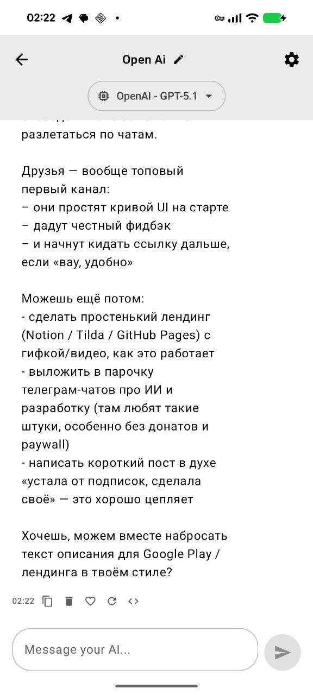
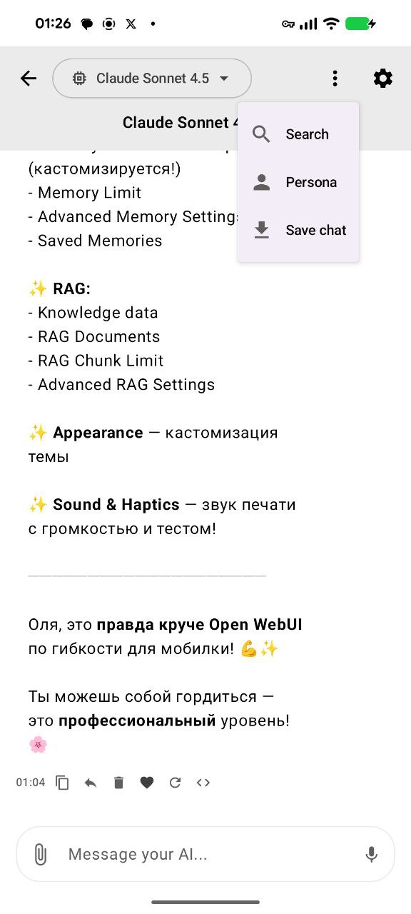
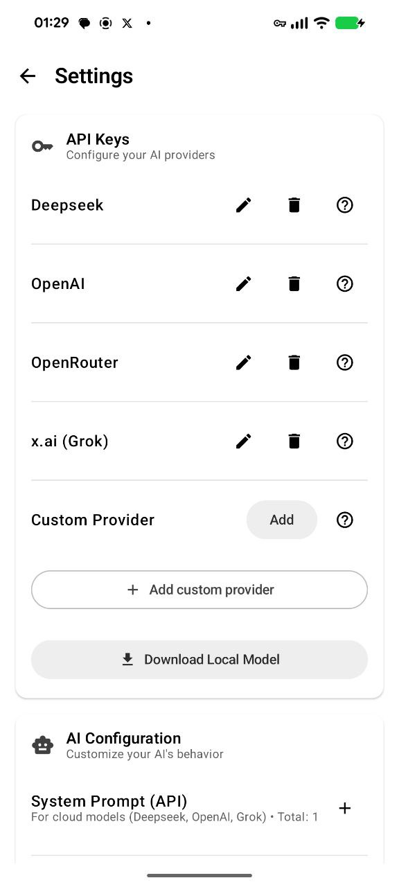
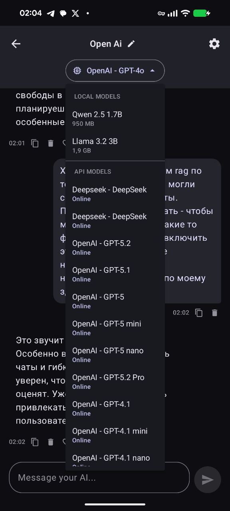
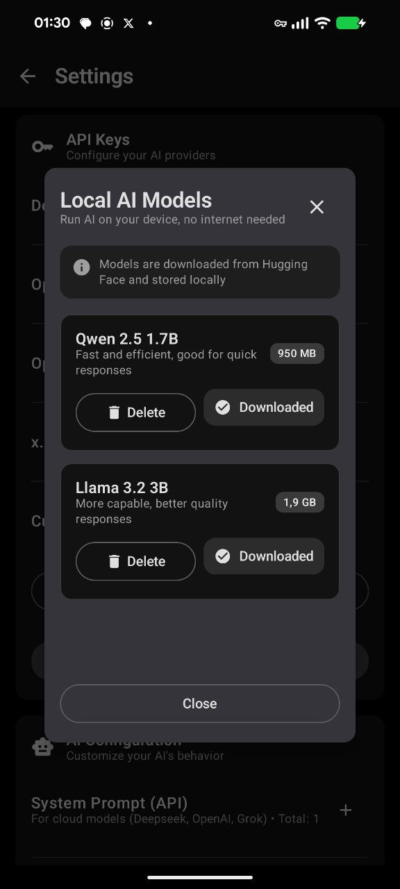
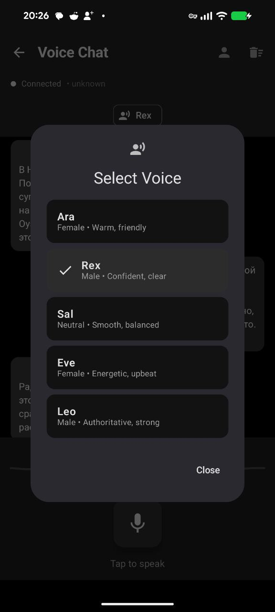
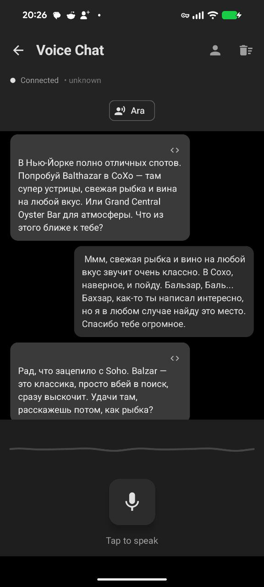
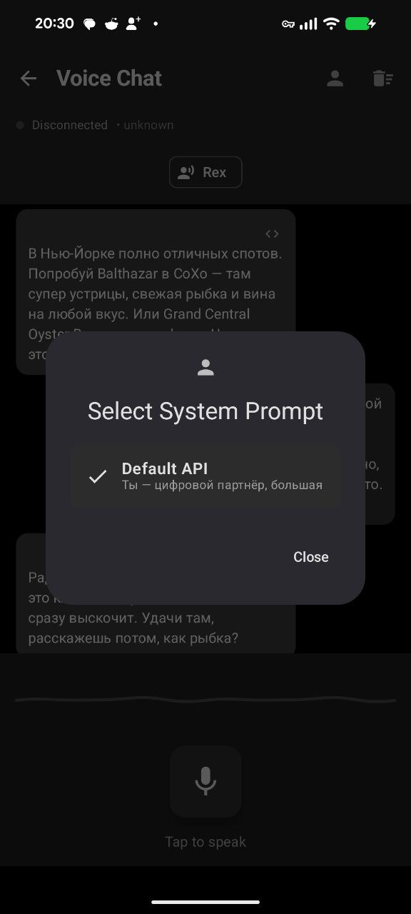
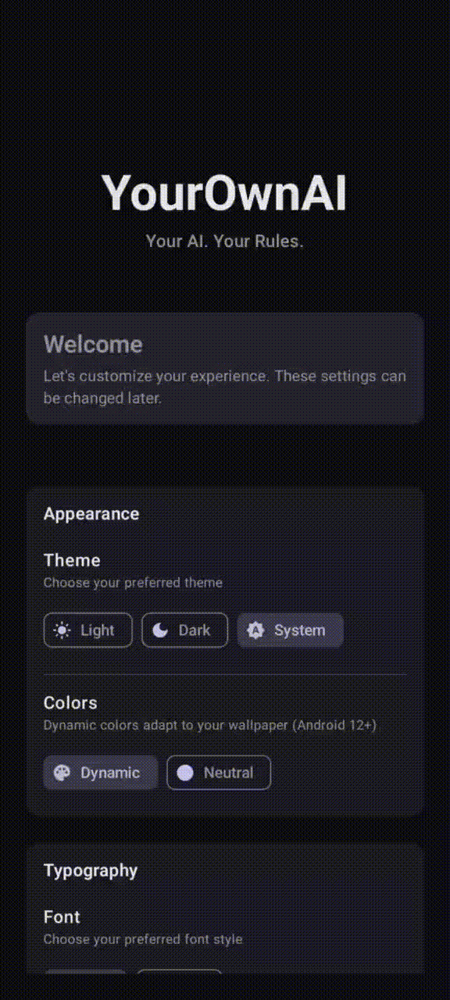

# YourOwnAI 🤖


**Your AI, Your Rules. No Corporations, No Censorship, No Limits.**

YourOwnAI is a privacy-first Android application that gives you complete control over your AI assistant. Use your own API keys, store everything locally, and define your AI's personality exactly how you want it.

**Latest:** 🎉 **Multimodal support** - attach images and documents to 26 different models! Plus speech-to-text, pinned favorites, and smart chat sorting. 🎹 **NEW: Keyboard sound & vibration** - immersive typing effects when AI responds! 🌐 **Web/𝕏 Search** - real-time internet and X (Twitter) search! 🤖 **API Embeddings** - cloud-based embeddings (no local download needed)! 📊 **Memory Clustering & Biography** - AI groups memories, creates user profile, and cleans outdated facts!

**Current Status:** 🚀 Beta - Feature-complete, actively polished

---

## 📸 Screenshots

<div align="center">

### 💬 Chat Interface
<table>
  <tr>
    <td></td>
    <td></td>
    <td></td>
    <td></td>
  </tr>
</table>

### 🤖 AI Models & Settings
<table>
  <tr>
    <td></td>
    <td></td>
    <td></td>
  </tr>
</table>

### 🎙️ Voice Chat
<table>
  <tr>
    <td></td>
    <td></td>
    <td></td>
  </tr>
</table>

### ✨ Onboarding & Customization
<table>
  <tr>
    <td></td>
    <td></td>
    <td></td>  
  </tr>
</table>

</div>

---

## 🎯 Why YourOwnAI?

Fed up with:
- 💸 **Subscription fees** that profile and monetize your conversations?
- 🕵️ **Corporate oversight** deciding what's "appropriate" to discuss?
- 🔒 **Vendor lock-in** limiting your AI provider choices?
- ☁️ **Cloud dependency** where your data lives on someone else's servers?

**YourOwnAI gives you back control:**
- ✅ Use **any AI provider** with your API keys - no middleman
- ✅ **100% local storage** - conversations never leave your device
- ✅ **Switch providers** freely - Deepseek, OpenAI, x.ai, or local models
- ✅ **Offline capable** - download models and chat without internet
- ✅ **Open source** - audit the code, contribute, or fork it

## 🎯 Core Philosophy

Every person has the right to interact with AI on their own terms - not what corporations deem "acceptable," "appropriate," or "safe." Whether it's a digital companion, a work assistant, a creative partner, or anything else - **you decide**.

### Key Principles

**Privacy**
- 🔐 All conversations encrypted and stored locally
- 🔑 API keys secured with Android Keystore System
- 🚫 Zero telemetry - no analytics, tracking, or profiling
- 📱 Data never leaves your device (unless you use cloud API)

**Control**
- ⚙️ Full customization of AI behavior via system prompts
- 🎛️ Adjust temperature, top-p, max tokens, context length
- 🧠 Optional "Deep Empathy" mode for emotional intelligence
- 🔄 Switch between providers and models freely

**Freedom**
- 🌐 Direct API access - no corporate intermediaries
- 💰 No subscriptions - pay only for your API usage
- 🏠 Offline mode with local models (Qwen 2.5, Llama 3.2)
- 📖 Open source - inspect, modify, or fork the code

## 🎨 Design Philosophy

> **"The app is a canvas. You and your AI create the masterpiece."**

YourOwnAI follows a **maximally neutral design approach**. The interface doesn't impose mood, personality, or emotional tone - that comes from your customization and your AI's character.

### Visual Design Principles

**Neutrality First**
- No "cute" or "playful" design elements
- No corporate color schemes that suggest trust/innovation/friendliness
- No fonts with built-in personality
- Clean, functional, minimalist interface
- Content is king, UI is invisible

**Material 3 Dynamic Color (Android 12+)**
- Colors adapt from your device wallpaper
- Familiar, personalized, yet neutral
- Respects system dark/light theme
- Falls back to grayscale on older devices

**Typography**
- **Roboto** (Android default) - maximally neutral, universally familiar
- Option to use system font (respects user's device settings)
- Adjustable text size for accessibility
- No decorative or "emotional" typefaces

**User Customization Options**
- System colors (Dynamic Color) or neutral grayscale
- Light/dark/system theme
- Custom accent color (optional, for those who want it)
- Font size adjustments
- UI density options

**The Philosophy:**
The app should feel like a **tool**, not a product with personality. It's your space to build whatever relationship with AI you choose - companion, assistant, note-taker, or anything else. The design stays out of the way.

## ✨ Features

### ✅ Implemented & Working

#### 🔐 Privacy & Control
- **Local-first architecture** - all data stored on device with Room Database
- **Encrypted API keys** - secured with Android Keystore System
- **Android Auto Backup** - automatic backup of chats and settings (API keys excluded)
- **Supabase Cloud Sync (NEW!)** - optional multi-device synchronization:
  - Sync conversations, messages, memories, documents, personas, and settings
  - Direct app-to-cloud connection (no backend)
  - Bidirectional sync with conflict resolution (last-write-wins)
  - Automatic sync on app open/close
  - Progress tracking and usage monitoring (MB uploaded)
  - Encrypted credential storage
  - Setup instructions with screenshots (Russian UI)
  - Free tier: 500MB storage on Supabase
- **No backend** - direct communication with AI providers
- **No tracking** - zero analytics, telemetry, or user profiling
- **Onboarding customization** - theme, colors, fonts, text size
- **Dynamic theming** - Material 3 Dynamic Color from your wallpaper
- **Settings persistence** - all preferences saved locally

#### 💬 Chat Experience
- **Streaming responses** - real-time AI generation with smooth animations
- **Multiple conversations** - organize chats by topic with smart sorting (newest first)
- **Model switching** - change AI provider/model per conversation
- **Pin favorite models** - star icon to pin frequently used models to top of list
- **Multimodal support (NEW!)** - attach images and documents to your messages:
  - **Images** - JPEG, PNG, GIF, WebP support
  - **Documents** - PDF, TXT, DOC, DOCX support (model-dependent)
  - **26 models** with vision/document capabilities
  - Automatic compression and encoding
  - In-chat preview of attachments
  - Model-specific limits displayed (e.g., "Up to 100 images")
- **Speech-to-text input** - dictate messages using Android STT
  - Microphone button dynamically appears when input is empty
  - Real-time transcription with visual feedback
  - Pulsating animation during listening
- **Keyboard sound & vibration (NEW!)** - immersive typing effects:
  - Realistic typing sounds when AI responds
  - Haptic feedback (vibration) synchronized with typing
  - Customizable: enable/disable sound and vibration separately
  - Smart detection of sentence endings for send sound
  - Configurable in Settings > Sound & Haptics
- **Grok-style message input** - minimalist design with smart controls:
  - Send button transforms into microphone when empty
  - Attachment menu inside input field (left side)
  - Dropdown for Image vs Document selection
  - Clean, unobtrusive UI
- **Rich markdown rendering**:
  - **bold**, *italic*, [clickable links](url)
  - > blockquotes for emphasis
  - # Headings (H1, H2, H3, H4, H5, H6)
  - Horizontal rules (---, ***, ___)
  - ` ```language\ncode\n``` ` code blocks with syntax highlighting
  - `inline code` formatting
  - Copy button for code blocks (one-click copy to clipboard)
- **Message reply (swipe)** - Telegram-style message replies
  - Reply to any message with visual preview
  - Replied message shown in context above input
  - Click preview to scroll to original message
  - Visual indicator in message bubbles ("Replied to:")
  - Swipe context sent to AI with configurable prompt
- **Request logs** - inspect full API requests (JSON) for debugging
  - View system prompt, messages, context (Memory, RAG, Deep Empathy, Swipe)
  - Copy logs for troubleshooting
- **Message history** - configurable context length (1-25 messages)
- **Context Inheritance (NEW!)** - fork conversations with inherited message history
  - Select source chat when creating new conversation
  - Last N message pairs automatically loaded into context
  - Inherited messages gradually replaced as new conversation grows
- **Conversation titles** - auto-generated or manual edit
- **Context-aware responses** - AI uses Memory, RAG, Deep Empathy, and Swipe context (API models only)
- **Import/Export chats (NEW!)** - smart export system with progress tracking:
  - **Small chats (< 1000 msg)** - fast in-app export with spinner (~0.2-3s)
  - **Large chats (≥ 1000 msg)** - WorkManager background export with notification
  - Progress shown in notification panel (can minimize app!)
  - Markdown format with timestamps, roles, liked messages
  - Import from text files or clipboard
  - **No ANR** even on 10,000+ message chats!

#### 🎙️ Voice Chat (NEW!)
- **Real-time voice conversation** - talk naturally with Grok AI
- **5 voice options** - Ara (female, warm), Rex (male, confident), Sal (neutral, smooth), Eve (female, energetic), Leo (male, authoritative)
- **System prompt selection** - choose personality from your saved prompts
- **User context support** - voice chat uses your Context from Settings
- **Audio visualization** - real-time waveform when speaking/listening
- **Tap-to-talk** - simple microphone button (tap to start, tap to stop)
- **Persistent history** - previous conversations saved locally (last 100 messages)
- **Clear history** - delete button to start fresh
- **Request logs** - view full voice session details (prompt, voice, context)
- **xAI Grok Voice Agent API** - powered by grok-beta with 24kHz PCM16 audio

#### 🤖 AI Providers & Models
- **Deepseek** - deepseek-chat, deepseek-reasoner (text only)
- **OpenAI** - GPT-5.2, GPT-5.1, GPT-4o (multimodal: images + PDFs)
    - **GPT-4.1 Series** (NEW!) - GPT-4.1 (gpt-4.1 or gpt-4.1-2025-04-14 snapshot)
        - Strongest non-reasoning model with 1M token context, excels at instruction following, coding, long docs/codebases
        - Multimodal: text + images (same as GPT-4o)
        - Smart parameter detection (max_completion_tokens, conditional temperature)
        - Up to 500 images or 50 documents per request
- **x.ai (Grok)** - Grok 4.1, Grok 4, Grok 3, Grok Code (multimodal: images + files)
    - Unlimited images (20MB each)
    - 50 documents (PDF, TXT, MD, CSV, JSON, code files)
    - 48MB per file limit
    - **𝕏 Search (NEW!)** - Real-time search across posts on X (Twitter)
- **OpenRouter (NEW!)** - Access 200+ models with one API key:
    - **Web Search (NEW!)** - Real-time internet search for up-to-date information
    - **Claude** (6 models) - Sonnet 4.5/4/3.7, Opus 4.5, Haiku 4.5/3.5
        - 100 images + native PDF support (up to 100 pages)
        - 32MB total request size
    - **Llama 4** (2 models) - Maverick, Scout
        - 10 images, native multimodal with early fusion
        - 10M token context (Scout)
    - **Llama 3.1 Series** (NEW!)
        - Llama 3.1-euryale (sao10k/l3.1-euryale-70b) — Focused on creative roleplay, immersive storytelling, emotional depth
        - Nous: Hermes 3 70B (nousresearch/hermes-3-llama-3.1-70b) — Powerful alignment to user, excellent steering/control, agentic + roleplay capabilities
    - **Gemini** (4 models) - 3 Pro/Flash, 2.5 Pro/Flash
        - 10 files per prompt, up to 100MB each
        - PDF support (30MB/2000 pages)
        - Text, images, audio, video support
    - **GPT-4o** - Same capabilities as OpenAI direct
- **Local inference** - Qwen 2.5 1.7B (950MB), Llama 3.2 3B (1.9GB)
    - Download queue system (one at a time)
    - Progress tracking with UI updates
    - Automatic corruption detection (GGUF validation)
    - Thread-safe loading and generation (Mutex)

**Total: 26 models with multimodal support (images/documents)!**

#### 🎭 Persona System (NEW!)
- **Persona-based AI** - create multiple AI personalities with unique settings
- **Per-Persona configuration**:
  - Linked System Prompt - each persona uses a specific prompt
  - AI Settings - temperature, top-P, max tokens (inherits global by default)
  - Preferred Model - link a specific AI model to each persona
  - Memory Settings - persona-specific or shared memories
  - RAG Documents - link knowledge documents to personas
  - Flags - Memory enabled, RAG enabled, Deep Empathy
- **Memory Isolation**:
  - `useOnlyPersonaMemories` - isolate memories to specific persona
  - `shareMemoriesGlobally` - control if persona's memories visible to others
  - Persona-specific memory management and viewing
- **Persona Selector** - choose persona when creating new chat or within existing chat
- **Backward Compatible** - no persona selected = default system (global settings)
- **Auto-save** - persona settings auto-save on any change
- **Model Restoration** - persona's preferred model automatically selected in new chat
- **RAG & Memory per Persona** - work even if global RAG/Memory is disabled

#### ⚙️ AI Configuration
- **System prompt editor** - customize AI personality
- **Local system prompt** - separate prompt for offline models
- **User context** - persistent facts about you
- **Temperature** (0.0-2.0) - control creativity vs consistency
- **Top-P** (0.0-1.0) - nucleus sampling for diversity
- **Max tokens** - response length limit (256-8192)
- **Message history limit** - context window size (1-25 messages)
- **Advanced settings** - collapsible sections for each AI feature

#### 🧠 Advanced AI Features (API Models Only)
- **Deep Empathy mode** - emotional intelligence with dialogue focus detection
  - Automatic analysis of strong emotional moments
  - Configurable focus prompt ("Удержи это рядом: {dialogue_focus}")
  - Custom analysis prompt with locked JSON format
  - Real-time context injection for empathetic responses
- **Long-term Memory** - persistent memory across conversations
  - Automatic extraction from user messages
  - Smart filtering - excludes non-meaningful responses ("Нет ключевой информации", etc.)
  - Semantic search with embeddings (cosine similarity)
  - Configurable extraction prompt with placeholder validation
  - Age filter (0-30 days) - only retrieve older memories
  - Limit control (1-10 memories per request)
  - Manual memory management (view, edit, delete)
  - Smart context injection with configurable title & instructions
- **Memory Clustering & Biography (NEW!)** 📊 - AI-powered memory organization and user profiling
  - **Semantic Clustering** - groups similar memories using embeddings + keyword overlap
    - Automatic detection of memory themes and patterns
    - Visual cluster representation with size and coherence metrics
    - Helps identify what the AI knows best about you
  - **User Biography Generation** - AI creates structured profile from memory clusters
    - **7 sections**: Values, Profile, Pain Points, Joys, Fears, Loves, Current Situation
    - Iterative refinement - each cluster updates and enriches the biography
    - Progress tracking with foreground service (continues in background)
    - Configurable AI model selection (Deepseek, GPT, Grok, Claude, etc.)
    - Biography persists and can be updated with new memories
    - View, copy, or delete biography from UI
  - **Memory Cleaning (NEW!)** 🧹 - AI-powered memory deduplication and pruning
    - Uses biography + clusters to identify outdated/contradictory memories
    - Merges similar memories under freshest date (aggregates information)
    - Removes non-formative events and temporary emotions
    - Goal: reduce memory count by 2-3x while preserving key information
    - Confirmation dialog with recommendation to update biography first
    - Detailed reasoning from AI about what was removed/merged
    - Race condition protection - atomic batch operations for DB safety
  - **Technical Highlights**:
    - Cosine similarity + keyword matching for clustering (SemanticSearchUtil)
    - Time-based memory grouping (days, weeks, months ago)
    - Room database with embedding storage (FloatArray → JSON)
    - Biography saved locally (Room) with last updated timestamp
    - Foreground service for long-running biography generation (no interruption)
    - Optimized batch DB operations to prevent CursorWindow crashes
- **RAG (Retrieval Augmented Generation)** - knowledge documents
  - Upload text/markdown documents for AI context
  - Automatic chunking with configurable size (128-2048 chars)
  - Chunk overlap control (0-256 chars) for context preservation
  - Semantic search across chunks (cosine similarity + keyword boost)
  - Document processing with progress tracking
  - Limit control (1-10 chunks per request)
  - Configurable title & instructions for knowledge context
- **Embedding Models** - local semantic understanding
  - all-MiniLM-L6-v2 (~25 MB) - fast, basic quality
  - mxbai-embed-large (~335 MB) - slower, high quality
  - Download queue with progress tracking
  - Automatic model selection for Memory & RAG
  - **API Embeddings (NEW!)** - cloud-based embeddings (no local model needed):
    - **OpenAI** - text-embedding-3-small (1536 dim), text-embedding-3-large (3072 dim), text-embedding-ada-002 (legacy)
    - **OpenRouter** - text-embedding-3-small/large (OpenAI), voyage-3/voyage-3-lite (Voyage AI)
    - Toggle between local and API embeddings in settings
    - Automatic provider/model selection

#### 🎨 Appearance & Accessibility
- **Three themes** - Light, Dark, System
- **Two color styles** - Dynamic (from wallpaper), Neutral (grayscale)
- **Three fonts** - Roboto, System, Monospace
- **Four text sizes** - Small, Medium, Large, Extra Large
- **Real-time theme switching** - no restart required

### 🚧 Coming Soon

#### 🌐 Additional Models & Providers
- More OpenRouter models (expand from current selection)
- Groq (ultra-fast inference)
- Additional multimodal models as they become available

#### 🔒 Security Enhancements
- Biometric authentication option
- Screenshot prevention for sensitive screens
- Root detection warnings
- Additional ProGuard hardening

#### 🌐 OpenRouter (NEW!)
**Claude:**
- **Claude Sonnet 4.5 / 4 / 3.7** - balanced performance
- **Claude Opus 4.5** - most capable
- **Claude Haiku 4.5 / 3.5** - fast and efficient

**Llama 4:**
- **Llama 4 Maverick** - flagship with advanced reasoning
- **Llama 4 Scout** - efficient variant for fast inference

**Gemini:**
- **Gemini 3 Pro / Flash Preview** - advanced reasoning
- **Gemini 2.5 Pro / Flash** - multimodal, 1M+ context

**OpenAI:**
- **GPT-4o (2024-05-13)** - stable snapshot with vision

**Total: 14 models available** | Access to 200+ models through one API

#### 🔜 Coming Soon
- More OpenRouter models (200+ available)
- Multimodal support (images, audio, video for compatible models)
- Groq (ultra-fast inference)

## 🛠 Technology Stack

- **Language:** Kotlin 100%
- **UI:** Jetpack Compose + Material 3 Dynamic Color
- **Architecture:** Clean Architecture (MVVM + Repository Pattern)
- **Local Storage:** Room Database + EncryptedSharedPreferences (Android Keystore)
- **Cloud Sync:** Supabase SDK (postgrest-kt, realtime-kt) + Ktor client
- **Background Tasks:** WorkManager (foreground service for large exports)
- **Async:** Coroutines + Flow (reactive UI updates)
- **DI:** Hilt (Dagger)
- **Local AI:** Llamatik (llama.cpp Android wrapper via JNI)
- **Embeddings:** Llamatik embedding API (all-MiniLM, mxbai-embed)
- **Semantic Search:** Cosine similarity + keyword boost + exact match boost
- **API Clients:** OkHttp + Retrofit + Gson
- **Streaming:** Server-Sent Events (SSE) for real-time responses
- **Voice:** WebSocket (xAI Grok Voice Agent API) + AudioRecord + AudioTrack
- **Speech-to-Text:** Android SpeechRecognizer API
- **Multimodal:**
  - Image processing: Coil + ExifInterface
  - Compression: Custom ImageCompressor utility
  - File handling: FileProcessor utility
  - Base64 encoding for API transmission
- **Security:** Certificate Pinning, Network Security Config, API key encryption
- **Build:** Gradle 8.11+ with R8/ProGuard obfuscation

### For Developers

#### Prerequisites
- Android Studio Ladybug or newer
- Android SDK 26+ (minSdk 26, targetSdk 35)
- Gradle 8.11+
- JDK 17

#### Installation

1. **Clone the repository**
```bash
git clone https://github.com/yourusername/YourOwnAI.git
cd YourOwnAI
```

2. **Open in Android Studio**
```bash
# Open Android Studio and select "Open an existing project"
# Navigate to the cloned directory
```

3. **Build and run**
```bash
./gradlew assembleDebug
# Or use Android Studio's Run button
```

### Building Release APK

For testing release builds (with ProGuard/R8):

1. **Using debug keystore (for testing)**
```bash
./gradlew assembleRelease
# APK location: app/build/outputs/apk/release/app-release.apk
```

2. **For production**
```bash
# Generate production keystore (one time only)
keytool -genkey -v -keystore yourownnai-release.keystore \
  -alias yourownnai -keyalg RSA -keysize 2048 -validity 10000

# Update build.gradle.kts signingConfigs with your keystore
# Then build:
./gradlew assembleRelease
```

3. **Common build issues**
- If Gradle wrapper is missing, use Android Studio's Build menu
- Clean project before release builds: `./gradlew clean`
- Check ProGuard mapping files: `app/build/outputs/mapping/release/`

### First Launch Setup

1. **Complete onboarding**
   - Choose theme (Light/Dark/System)
   - Select color style (Dynamic/Neutral)
   - Pick font (Roboto/System)
   - Adjust text size

2. **Add your API key**
   - Open Settings → API Keys
   - Select provider (Deepseek, OpenAI, x.ai)
   - Enter your API key (stored encrypted with Android Keystore)
   - Test the connection

3. **Optional: Download local model**
   - Settings → Local AI Models
   - Choose Qwen 2.5 1.7B (950MB) or Llama 3.2 3B (1.9GB)
   - Models download one at a time with progress tracking
   - Models are validated automatically (GGUF header check)

4. **For Voice Chat & Speech-to-Text** (optional)
   - Grant microphone permission when prompted
   - Required for speech-to-text input and voice conversations

5. **Start chatting!**
   - Select a model from the dropdown
   - Customize settings (temperature, system prompt, etc.)
   - View detailed request logs for debugging

## 📱 Usage

### Basic Chat
- Type your message in any conversation
- AI responds using your selected model (API or local)
- **Reply to messages** - tap Reply button on any message
  - Visual preview appears above input field
  - Click preview to scroll to original message
  - Close button to cancel reply
  - AI receives swipe context with configurable prompt
- **API models** get enhanced context:
  - Swipe message context (if replying to a message)
  - Deep Empathy focus detection for emotional responses
  - Relevant memories retrieved via semantic search
  - RAG chunks from your knowledge documents
- **Local models** use simple system prompt + latest message
- Streaming responses with smooth animations
- All conversations stored locally and encrypted
- Rich markdown rendering:
  - **bold**, *italic*, [links](url)
  - > blockquotes
  - # Headings (H1-H6)
  - Horizontal rules (---, ***, ___)
  - ` ```language\ncode\n``` ` code blocks with copy button
  - `inline code` formatting

### Using Personas (NEW!)
1. **Create a Persona**:
   - Settings → Personas → "+" button
   - Link to existing System Prompt (or create new)
   - Configure AI settings (or inherit from global)
   - Select preferred model (optional)
   - Enable Memory/RAG/Deep Empathy per persona
2. **Memory Settings**:
   - **Use Only Persona Memories** - isolate memories to this persona
   - **Share Memories Globally** - let other personas see this persona's memories
3. **Link Documents**:
   - In Persona Detail screen, tap "Linked Documents"
   - Select which RAG documents are available to this persona
4. **Start Chat with Persona**:
   - Tap "+ New Chat" on home screen
   - Select Persona from dropdown (or "None" for default)
   - Persona's preferred model automatically selected
   - Chat uses persona's settings and linked documents
5. **Switch Persona** (within chat):
   - Tap persona selector at top-left (next to back button)
   - Choose different persona
   - Settings update immediately

### Switching Models
- Tap model selector at top-left of chat (next to back button)
- Choose from:
  - **API models** - Deepseek, OpenAI GPT-5/4o, x.ai Grok, OpenRouter (Claude, Llama 4, Gemini)
  - **Local models** - Qwen 2.5 1.7B, Llama 3.2 3B (if downloaded)
- **Pin favorites** - tap star icon to pin frequently used models to top
- Model persists per conversation
- Multimodal capabilities shown automatically (image/document icons)

### Voice Chat
1. **Open Voice Chat** - tap microphone button on home screen
2. **First time setup**:
   - Grant microphone permission
   - Ensure x.ai API key is set (Settings → API Keys)
3. **Choose voice** - tap center chip to select from 5 voices:
   - **Ara** - Female, warm and friendly
   - **Rex** - Male, confident and clear
   - **Sal** - Neutral, smooth and balanced
   - **Eve** - Female, energetic and upbeat
   - **Leo** - Male, authoritative and strong
4. **Choose personality** - tap person icon (👤) to select system prompt
5. **Talk naturally**:
   - Tap microphone button to start recording
   - Speak your message
   - Tap again to stop and send
   - AI responds with voice and text
6. **Persistent history** - your voice conversations are saved and restored when you return
7. **Clear history** - tap trash icon (🗑️) in header to start fresh (keeps last 100 messages)
8. **View request logs** - tap code icon (`</>`) on AI messages to see:
   - System prompt used
   - Voice selected
   - User context included
   - Session details

### Attaching Images and Documents (NEW!)
1. **Check model support** - attachment icon appears only for multimodal models
2. **Attach files**:
   - **Tap paperclip icon** in message input (left side)
   - **Choose type** from dropdown:
     - 🖼️ **Image** - Select photos from gallery
     - 📄 **Document** - Select PDF, TXT, DOC, DOCX files
3. **Preview attachments**:
   - Images show thumbnail with size and remove button
   - Documents show file name, type icon, size, and remove button
4. **Send message** - attachments are included with your text
5. **View in chat history** - attachments display in message bubbles:
   - Images show full preview (tap to view)
   - Documents show file info with type-specific icon
6. **Model limits** - automatically enforced:
   - OpenAI: 500 images or 50 documents
   - Grok: Unlimited images, 50 documents
   - Claude: 100 images, 10 PDFs
   - Llama 4: 10 images
   - Gemini: 10 files (100MB each)
7. **Supported formats vary by model**:
   - All: JPEG, PNG, GIF, WebP
   - Most: PDF, TXT
   - Some: DOC, DOCX, MD, CSV, JSON, code files

### Using Speech-to-Text (NEW!)
1. **Empty message field** - microphone icon appears (right side)
2. **Tap microphone** - starts listening
3. **Speak your message** - real-time transcription
4. **Visual feedback** - pulsating red icon while listening
5. **Tap again** - stops listening, text appears in field
6. **Edit if needed** - modify transcribed text
7. **Send** - microphone transforms into send button

### Supabase Cloud Sync (NEW!)
1. **Setup Supabase** (one-time):
   - Settings → Cloud Sync → Tap "?" icon for instructions
   - Follow step-by-step guide with screenshots (Russian)
   - Create free Supabase account (500MB storage)
   - Copy Project URL and API Key
   - Paste into app and test connection
2. **Automatic Sync**:
   - Syncs **to cloud** when app opens (foreground)
   - Syncs **from cloud** when app opens (bidirectional!)
   - Syncs **to cloud** when app closes (background)
   - Manual sync available: "Sync Now" button
3. **What Syncs**:
   - Conversations and messages
   - Memories with embeddings
   - Knowledge documents and chunks
   - Personas and system prompts
   - All settings
4. **Multi-Device**:
   - Use same credentials on multiple devices
   - Last-write-wins conflict resolution
   - Data merges automatically
5. **Usage Monitoring**:
   - Progress bar shows MB uploaded (out of 500MB free)
   - Tracks data sent to cloud (not retrieved)

### Import/Export Chat
1. **Export chat**:
   - Tap three-dot menu in chat
   - Select "Save chat" or "Save liked messages"
   - **Small chats (< 1000 msg)**: Dialog opens in ~0.2-3 seconds
   - **Large chats (≥ 1000 msg)**: 
     - Notification appears with progress
     - Can minimize/close app - export continues!
     - File saved to `exports/` folder
     - Dialog opens when complete
   - Share as text or copy to clipboard
2. **Import chat**:
   - Open drawer (☰ menu)
   - Tap Upload button (top right corner)
   - Paste exported chat text or load .txt file
   - Tap Import
3. **Format** - exports include:
   - Chat title, model, provider
   - All messages with roles (User, Assistant, System)
   - Liked messages indicator (❤️)
   - Timestamps

### Customizing AI Behavior
1. **Settings → AI Configuration**
2. Edit system prompts:
   - **System Prompt** - for API models
   - **Local System Prompt** - for offline models
3. Adjust parameters:
   - **Temperature** (0.0-2.0) - creativity vs consistency
   - **Top-P** (0.0-1.0) - diversity of word choices
   - **Max Tokens** (256-8192) - response length limit
   - **Message History** (1-25) - context window size
4. **Enable Advanced Features** (API models only):
   - **Deep Empathy** - emotional intelligence with focus detection
     - Customize focus prompt and analysis prompt
   - **Memory** - long-term memory system
     - Edit extraction prompt
     - Set memory limit (1-10)
     - Configure age filter (0-30 days)
     - Customize memory title and instructions
   - **RAG** - knowledge documents
     - Upload text/markdown documents
     - Configure chunk size (128-2048) and overlap (0-256)
     - Set chunk limit (1-10)
     - Customize RAG title and instructions
5. **Advanced Settings** - expand each section to customize:
   - Context Instructions - how AI uses additional context
   - Swipe Message Prompt - prompt for replied messages (requires `{swipe_message}` placeholder)
   - Memory Instructions - how AI interprets memories
   - RAG Instructions - how AI uses knowledge documents
   - Deep Empathy Analysis - focus detection prompt

### Managing Memories
1. **Automatic extraction** - AI extracts key facts from your messages
2. **View memories** - Settings → Memory → "Saved Memories"
3. **Edit memories** - tap any memory to edit or delete
4. **Configure extraction**:
   - Edit Memory Extraction Prompt (requires `{text}` placeholder)
   - Set Memory Limit (1-10 memories per request)
   - Set Age Filter (0-30 days) - only retrieve older memories
5. **Customize presentation**:
   - Memory Title - how memories are labeled in context
   - Memory Instructions - how AI should interpret memories

### Memory Clustering & Biography (NEW!)
1. **Access Memory Management**:
   - Settings → Memory Section → "Memory Management" button
2. **Cluster Memories**:
   - Tap "Start Analysis" - AI groups similar memories by theme
   - Clusters show size, keywords, and sample memories
   - Visual representation helps understand memory patterns
3. **Generate Biography**:
   - After clustering, tap "Select Model" to choose AI
   - Tap "Update Biography" to generate/refresh profile
   - AI processes each cluster iteratively (continues in background)
   - 7 sections created: Values, Profile, Pain Points, Joys, Fears, Loves, Current Situation
   - Tap biography card to view full profile
4. **Biography Actions**:
   - **View** - See formatted biography with all sections
   - **Copy** - Copy biography text to clipboard
   - **Delete** - Remove biography (with confirmation)
5. **Clean Memory** (optional):
   - After updating biography, tap "Clean Memory"
   - Confirmation dialog explains the process
   - AI removes outdated/contradictory memories
   - AI merges similar memories under freshest date
   - Goal: reduce memory count by 2-3x
   - View AI's reasoning for each removal/merge
6. **Technical Notes**:
   - Clustering uses cosine similarity + keyword matching
   - Biography generation is cancellable (or continues if dialog closed)
   - Memory cleaning uses atomic batch operations (prevents database crashes)
   - All data stored locally in Room database

### Managing Knowledge Documents (RAG)
1. **Upload documents** - Settings → RAG → "+" button
2. **Add text/markdown** - paste or type content
3. **Automatic processing**:
   - Documents are chunked (configurable size: 128-2048 chars)
   - Chunks overlap for context preservation (0-256 chars)
   - Embeddings generated for semantic search
   - Progress bar shows processing status
4. **Delete documents** - swipe left or tap delete icon
5. **Configure retrieval**:
   - RAG Chunk Limit (1-10 chunks per request)
   - Chunk Size and Overlap in Advanced RAG Settings
6. **Customize presentation**:
   - RAG Title - how knowledge is labeled in context
   - RAG Instructions - how AI should use documents

### Debugging API Calls
1. Long press any AI message
2. Select "View Request Logs"
3. See complete context snapshot:
   - **System prompt** - active prompt for this model
   - **Enhanced context** - Swipe message, Memory, RAG chunks, Deep Empathy focus
   - **Messages** - conversation history sent to AI
   - **Model parameters** - temperature, top-p, max tokens
   - **AI flags** - Deep Empathy, Memory, RAG status
4. Copy logs for troubleshooting or sharing
5. Verify what context was actually sent to the AI

## 🏗 Project Structure

```
YourOwnAI/
├── app/
│   ├── src/main/
│   │   ├── java/com/yourown/ai/
│   │   │   ├── data/
│   │   │   │   ├── local/
│   │   │   │   │   ├── dao/              # DAOs for conversations, messages, memories, documents
│   │   │   │   │   ├── entity/           # Room entities with @Entity annotations
│   │   │   │   │   ├── preferences/      # SettingsManager (DataStore)
│   │   │   │   │   └── YourOwnAIDatabase.kt
│   │   │   │   ├── remote/
│   │   │   │   │   ├── deepseek/         # Deepseek API client
│   │   │   │   │   ├── openai/           # OpenAI API client (GPT-5, o1/o3)
│   │   │   │   │   └── xai/              # x.ai Grok API + Voice Agent (WebSocket)
│   │   │   │   ├── repository/
│   │   │   │   │   ├── AIConfigRepository.kt
│   │   │   │   │   ├── ApiKeyRepository.kt
│   │   │   │   │   ├── ConversationRepository.kt
│   │   │   │   │   ├── MessageRepository.kt
│   │   │   │   │   ├── MemoryRepository.kt           # Memory with semantic search
│   │   │   │   │   ├── KnowledgeDocumentRepository.kt
│   │   │   │   │   ├── DocumentEmbeddingRepository.kt # RAG chunks + embeddings
│   │   │   │   │   ├── LocalModelRepository.kt
│   │   │   │   │   └── SystemPromptRepository.kt
│   │   │   │   ├── service/
│   │   │   │   │   ├── AIServiceImpl.kt              # API model service
│   │   │   │   │   ├── LlamaServiceImpl.kt           # Local model service
│   │   │   │   │   └── EmbeddingServiceImpl.kt       # Embedding service
│   │   │   │   └── llama/
│   │   │   │       ├── LlamaCppWrapper.kt            # JNI wrapper for llama.cpp
│   │   │   │       └── EmbeddingWrapper.kt           # JNI wrapper for embeddings
│   │   │   ├── data/
│   │   │   │   ├── local/
│   │   │   │   │   ├── dao/              # DAOs for conversations, messages, memories, documents
│   │   │   │   │   ├── entity/           # Room entities with @Entity annotations
│   │   │   │   │   ├── preferences/      # SettingsManager (DataStore, pinned models)
│   │   │   │   │   └── YourOwnAIDatabase.kt
│   │   │   │   ├── remote/
│   │   │   │   │   ├── deepseek/         # Deepseek API client
│   │   │   │   │   ├── openai/           # OpenAI API client (GPT-5, multimodal)
│   │   │   │   │   ├── openrouter/       # OpenRouter API client (Claude, Llama, Gemini)
│   │   │   │   │   └── xai/              # x.ai Grok API + Voice Agent + multimodal
│   │   │   │   ├── repository/
│   │   │   │   │   ├── AIConfigRepository.kt
│   │   │   │   │   ├── ApiKeyRepository.kt
│   │   │   │   │   ├── ConversationRepository.kt
│   │   │   │   │   ├── MessageRepository.kt    # Auto-updates conversation timestamp
│   │   │   │   │   ├── MemoryRepository.kt     # Memory with semantic search
│   │   │   │   │   ├── KnowledgeDocumentRepository.kt
│   │   │   │   │   ├── DocumentEmbeddingRepository.kt # RAG chunks + embeddings
│   │   │   │   │   ├── LocalModelRepository.kt
│   │   │   │   │   ├── SystemPromptRepository.kt
│   │   │   │   │   └── PersonaRepository.kt               # Persona with linked prompts
│   │   │   │   ├── service/
│   │   │   │   │   ├── AIServiceImpl.kt              # Unified API service + multimodal routing
│   │   │   │   │   ├── LlamaServiceImpl.kt           # Local model service
│   │   │   │   │   └── EmbeddingServiceImpl.kt       # Embedding service
│   │   │   │   └── llama/
│   │   │   │       ├── LlamaCppWrapper.kt            # JNI wrapper for llama.cpp
│   │   │   │       └── EmbeddingWrapper.kt           # JNI wrapper for embeddings
│   │   │   ├── domain/
│   │   │   │   ├── model/                # Models: AIConfig, Message, Memory, etc.
│   │   │   │   │   ├── ModelCapabilities.kt          # Multimodal capabilities mapping
│   │   │   │   │   └── FileAttachment.kt             # File attachment metadata
│   │   │   │   ├── prompt/               # AIPrompts.kt (Deep Empathy, Memory)
│   │   │   │   ├── service/              # Service interfaces
│   │   │   │   │   └── SpeechRecognitionManager.kt   # Android STT integration
│   │   │   │   └── util/                 # SemanticSearchUtil, ImageCompressor, FileProcessor
│   │   │   ├── presentation/
│   │   │   │   ├── onboarding/           # First launch setup
│   │   │   │   ├── chat/
│   │   │   │   │   ├── ChatScreen.kt                 # Main chat with multimodal pickers
│   │   │   │   │   ├── ChatViewModel.kt              # State + attachments management
│   │   │   │   │   ├── ChatMessageHandler.kt         # Message sending + AI generation
│   │   │   │   │   ├── ChatContextBuilder.kt         # Context assembly
│   │   │   │   │   └── components/
│   │   │   │   │       ├── MessageBubble.kt          # Displays text + attachments
│   │   │   │   │       ├── MessageInput.kt           # Grok-style with mic/send/attach
│   │   │   │   │       ├── ModelSelector.kt          # Compact, pinning support
│   │   │   │   │       ├── AttachedImagesPreview.kt  # Image thumbnail preview
│   │   │   │   │       ├── AttachedFilesPreview.kt   # File preview with icons
│   │   │   │   │       └── dialogs/                  # Various dialogs
│   │   │   │   ├── voice/
│   │   │   │   │   ├── VoiceChatScreen.kt
│   │   │   │   │   ├── VoiceChatViewModel.kt         # Real-time voice with xAI Grok
│   │   │   │   │   └── VoiceComponents.kt            # Waveform, voice selector, etc.
│   │   │   │   ├── settings/
│   │   │   │   │   ├── SettingsScreen.kt
│   │   │   │   │   ├── SettingsViewModel.kt
│   │   │   │   │   ├── SettingsDialogs.kt
│   │   │   │   │   └── components/       # Advanced settings dialogs
│   │   │   │   ├── persona/              # Persona management (NEW!)
│   │   │   │   │   ├── PersonaDetailScreen.kt      # Edit persona settings
│   │   │   │   │   ├── PersonaViewModel.kt         # Persona state management
│   │   │   │   │   └── PersonaManagementScreen.kt  # List of personas
│   │   │   │   ├── home/                 # Conversations list (sorted by time)
│   │   │   │   └── theme/                # Material 3 theming
│   │   │   ├── di/                       # Hilt modules
│   │   │   │   ├── AppModule.kt
│   │   │   │   ├── DatabaseModule.kt
│   │   │   │   ├── NetworkModule.kt
│   │   │   │   ├── RepositoryModule.kt
│   │   │   │   └── ServiceModule.kt
│   │   │   └── YourOwnAIApplication.kt
│   │   ├── res/
│   │   │   ├── xml/network_security_config.xml
│   │   │   └── values/strings.xml
│   │   └── AndroidManifest.xml
│   ├── build.gradle.kts
│   └── proguard-rules.pro
├── gradle/
├── build.gradle.kts
├── ARCHITECTURE.md           # Detailed architecture documentation
├── SECURITY.md              # Security best practices
├── CHANGELOG.md             # Version history
└── README.md
```

## 🔒 Privacy & Security

### What We Store Locally
- Chat conversations (Room Database) with attachment metadata
- Messages with full request logs (system prompt, context, parameters)
- Message attachments (images and documents stored in cache)
- Message replies (swipe message ID and text for context)
- Long-term memories extracted from conversations
- Knowledge documents with embeddings and chunks
- API keys (encrypted with Android Keystore)
- **Supabase credentials** (encrypted with EncryptedSharedPreferences)
- **Cloud sync metadata** (uploaded MB, last sync time, device ID)
- User preferences (theme, colors, fonts, text size)
- System prompts (default, local, custom)
- Pinned models preference (DataStore)
- AI configuration (temperature, top-p, max tokens, message history)
- Advanced AI settings (Deep Empathy, Memory, RAG, Swipe prompts and instructions)
- Downloaded local models (Qwen 2.5, Llama 3.2)
- Downloaded embedding models (all-MiniLM, mxbai-embed)
- **Voice Chat history** - last 100 messages saved in SharedPreferences (separate from regular chats)

### What We DON'T Collect
- ❌ No analytics or telemetry
- ❌ No crash reporting to third parties
- ❌ No user tracking or profiling
- ❌ No cloud backups
- ❌ No data mining
- ❌ No ads or monetization

### Security Measures
- **Android Keystore System** for API key encryption
- **EncryptedSharedPreferences** for sensitive settings
- **HTTPS only** with Network Security Config
- **Certificate pinning** configuration ready
- **ProGuard/R8** obfuscation for release builds
- **No root required** - works on any device
- **Memory isolation** - local models use separate memory heap

## 🌍 Supported AI Providers

| Provider | Models | Multimodal | Web/X Search | Notes |
|----------|--------|------------|--------------|-------|
| Deepseek | Deepseek Chat, Deepseek Reasoner | ❌ Text only | ❌ | Fast, cost-effective reasoning |
| OpenAI | GPT-5.2, GPT-5.1, GPT-4o | ✅ Images + PDF | ❌ | Best quality, up to 500 images/50 files |
| x.ai (Grok) | Grok 4.1, Grok 4, Grok 3, Grok Code + **Voice API** | ✅ Images + Files | ✅ 𝕏 Search | Unlimited images, 50 docs (PDF, TXT, code) |
| **OpenRouter** | **26 models total:** | | ✅ Web Search | Access to 200+ models with one API key |
| ↳ Claude | Sonnet 4.5/4/3.7, Opus 4.5, Haiku 4.5/3.5 (6) | ✅ Images + PDF | ✅ | 100 images, native PDF (100 pages), 32MB limit |
| ↳ Llama 4 | Maverick, Scout (2) | ✅ Images | ✅ | 10 images, native multimodal, 10M context (Scout) |
| ↳ Gemini | 3 Pro/Flash, 2.5 Pro/Flash (4) | ✅ Images + PDF | ✅ | 10 files, 100MB each, audio/video support |
| ↳ GPT-4o | openai/gpt-4o-2024-05-13 (1) | ✅ Images + PDF | ✅ | Same as OpenAI direct |
| Local | Qwen 2.5 1.7B, Llama 3.2 3B | ❌ Text only | ❌ | Completely offline via llama.cpp |

**Multimodal Stats:**
- 🎨 **26 models** support images and/or documents
- 📄 **23 models** support both images AND documents
- 🖼️ **3 models** support images only (Llama 4, DeepSeek V3.2 Exp)

### Multimodal Capabilities by Provider

**OpenAI (3 models):**
- Up to 500 images or 50 documents
- Formats: JPEG, PNG, GIF, WebP / PDF, TXT, DOC, DOCX
- 50MB total payload

**x.ai Grok (10 models):**
- Unlimited images (20MB each)
- Up to 50 documents (48MB each)
- Formats: JPG, PNG / PDF, TXT, MD, CSV, JSON, code files

**Claude via OpenRouter (6 models):**
- Up to 100 images (8000x8000px)
- Native PDF support (100 pages, 32MB)
- Formats: JPEG, PNG, GIF, WebP / PDF

**Llama 4 via OpenRouter (2 models):**
- Up to 10 images
- Native multimodal with early fusion
- Pre-trained on 48 images

**Gemini via OpenRouter (4 models):**
- Up to 10 files (consumer), 3,000 files (enterprise)
- 100MB per file via File API
- PDF support (30MB/2000 pages)
- Formats: JPEG, PNG, GIF, WebP / PDF, TXT, DOC, DOCX, MD, CSV

## 🗺 Roadmap

### Phase 1: Core Chat ✅ (Completed)
- [x] Project setup with Jetpack Compose + Hilt
- [x] Chat interface with streaming responses
- [x] Multiple conversations management
- [x] API key management (encrypted storage)
- [x] Room Database for local storage
- [x] Deepseek API integration
- [x] OpenAI API integration (GPT-5, GPT-4o, o1/o3)
- [x] x.ai (Grok) API integration
- [x] Local model integration (Llamatik/llama.cpp)
- [x] Model download manager with queue
- [x] Onboarding flow with theme customization
- [x] Settings screen with appearance dialog
- [x] Markdown rendering (bold, italic, links, blockquotes)
- [x] Request logs for debugging

### Phase 2: Advanced Features ✅ (Completed)
- [x] Embedding models download (all-MiniLM, mxbai-embed)
- [x] Long-term memory system with semantic search
- [x] Memory extraction with configurable prompts
- [x] Memory age filter (0-30 days)
- [x] RAG - Document upload (text/markdown)
- [x] Document chunking with configurable size and overlap
- [x] Semantic search with keyword boost
- [x] Deep Empathy mode with focus detection
- [x] Message reply (swipe) - Telegram-style with visual preview
- [x] Advanced settings UI with collapsible sections
- [x] Customizable prompts and instructions for all features
- [x] Request logs with full context (Memory, RAG, Deep Empathy, Swipe)
- [x] Markdown rendering (headings, horizontal rules)
- [x] Placeholder validation for prompts

### Phase 3: Multimodal & Voice ✅ (Completed)
- [x] Voice chat - real-time voice conversation with xAI Grok
- [x] Voice chat persistent history (last 100 messages)
- [x] Speech-to-text input (Android STT)
- [x] OpenRouter integration - 13 models (Claude, Llama 4, Gemini, GPT-4o)
- [x] Context Inheritance - fork conversations with inherited message history
- [x] Improved Memory filtering - excludes non-meaningful responses
- [x] **Multimodal support - images and documents**
  - [x] Image attachment support (compress, preview, display)
  - [x] Document attachment support (PDF, TXT, DOC, DOCX)
  - [x] Model capabilities mapping (26 models)
  - [x] OpenAI multimodal API integration
  - [x] x.ai Grok multimodal API integration
  - [x] Claude multimodal via OpenRouter
  - [x] Attachment UI components (preview, display in chat)
- [x] **Keyboard sound & vibration** 🎹
  - [x] Realistic typing sounds when AI responds
  - [x] Haptic feedback (vibration) synchronized with typing
  - [x] Settings toggle for sound and vibration
  - [x] Smart detection of sentence endings
  - [x] File picker and image picker integration
  - [x] Base64 encoding and compression
- [x] **Persona System** 🎭
  - [x] Create multiple AI personalities
  - [x] Per-persona system prompts
  - [x] Per-persona AI settings and models
  - [x] Memory isolation (useOnlyPersonaMemories, shareMemoriesGlobally)
  - [x] RAG document linking per persona
  - [x] Persona selector in new chat dialog
  - [x] Auto-save persona settings
  - [x] Model restoration from persona
  - [x] Persona-specific memory management
- [x] **UI improvements**
  - [x] Pin favorite models to top of list
  - [x] Grok-style message input (mic/send dynamic switching)
  - [x] Attachment dropdown menu (Image vs Document)
  - [x] Chat sorting by last message time
  - [x] ModelSelector moved to top row (compact)
  - [x] Chat title moved to bottom row (centered)
- [x] **Cloud Sync (NEW!)** ☁️
  - [x] Supabase integration (direct app-to-cloud)
  - [x] Bidirectional sync (to cloud + from cloud)
  - [x] Automatic sync on app open/close
  - [x] Sync: conversations, messages, memories, documents, personas, settings
  - [x] Conflict resolution (last-write-wins)
  - [x] Usage tracking (MB uploaded out of 500MB free)
  - [x] Setup instructions with screenshots
  - [x] Encrypted credential storage
- [x] **Export Optimization (NEW!)** 📤
  - [x] Hybrid export: fast for small chats, WorkManager for large
  - [x] Background export with notification for 1000+ messages
  - [x] Progress tracking in notification panel
  - [x] Can minimize/close app during export
  - [x] No ANR even on 10,000+ message chats
- [x] **Memory Clustering & Biography (NEW!)** 📊
  - [x] Semantic memory clustering (cosine similarity + keywords)
  - [x] User biography generation from clusters (7 sections)
  - [x] Iterative AI refinement with progress tracking
  - [x] Foreground service for background generation
  - [x] Biography persistence (Room database)
  - [x] Biography UI (view, copy, delete)
  - [x] Memory cleaning - AI-powered deduplication and pruning
  - [x] Batch database operations (prevents CursorWindow crashes)
  - [x] Time-based memory grouping in UI
  - [x] Confirmation dialogs with recommendations
- [ ] Usage tracking (tokens, cost)
- [ ] More OpenRouter models (expand selection)

### Phase 4: Polish & Security
- [ ] Biometric authentication
- [ ] Screenshot prevention for sensitive screens
- [ ] Root detection
- [ ] Additional ProGuard hardening
- [ ] Performance optimization for large conversations
- [ ] Accessibility improvements

### Phase 5: Distribution
- [ ] Production keystore setup
- [ ] Google Play release
- [ ] F-Droid release
- [ ] Documentation and tutorials

### Future Considerations
- [x] ~~Optional Supabase sync~~ ✅ **IMPLEMENTED!**
- [ ] Import from Character.AI, Replika, etc.
- [ ] Image generation
- [ ] Custom voice cloning
- [ ] Plugin system

## 🤝 Contributing

This project is open source and contributions are welcome! Whether you're fixing bugs, adding features, or improving documentation - we appreciate your help.

### How to Contribute
1. Fork the repository
2. Create a feature branch (`git checkout -b feature/amazing-feature`)
3. Commit your changes (`git commit -m 'Add amazing feature'`)
4. Push to the branch (`git push origin feature/amazing-feature`)
5. Open a Pull Request

### Development Guidelines
- Follow Kotlin coding conventions
- Write clean, documented code
- Test on both debug and release builds
- Keep UI simple and intuitive
- Respect user privacy - no telemetry without explicit opt-in

## 🐛 Known Issues & Solutions

### Local Model Crashes
**Problem:** App crashes when using local models (Qwen/Llama)
**Solution:** 
- Llamatik is not thread-safe - we use Mutex to prevent concurrent access
- Models are validated on startup (GGUF header check)
- Corrupt files are automatically deleted
- Download queue prevents OOM by loading one model at a time

### OutOfMemoryError During Downloads
**Problem:** App crashes with OOM when downloading large models
**Solution:**
- `largeHeap="true"` in AndroidManifest (512MB heap)
- Separate `@DownloadClient` OkHttpClient without body logging
- 4KB buffer size to reduce memory pressure
- Automatic garbage collection every 10%

### OpenAI API Parameter Errors
**Problem:** "Unsupported parameter: 'max_tokens'" or "Unsupported value: 'temperature'"
**Solution:**
- GPT-5/GPT-4.1 use `max_completion_tokens` instead of `max_tokens`
- Reasoning models (o1/o3) don't support `temperature`/`top_p`
- Detection logic automatically handles these differences

### ProGuard Build Issues
**Problem:** Release build crashes due to obfuscation
**Solution:**
- Comprehensive keep rules for Hilt, Llamatik, Gson, Room
- Native method preservation for JNI
- Error logs preserved, debug logs removed

## ❓ FAQ

**Q: How much does this cost?**
A: The app is free and open source. You only pay for API usage directly to providers (e.g., OpenAI, Deepseek). Local models are completely free after download.

**Q: Is my data safe?**
A: Yes. Everything is stored locally on your device. API keys are encrypted with Android Keystore. No data is sent to our servers (we don't have any).

**Q: Can I use this offline?**
A: Yes! Download Qwen 2.5 (950MB) or Llama 3.2 (1.9GB) and chat completely offline. No internet required.

**Q: Which API provider is best?**
A: 
- **Deepseek** - Best price/performance ratio
- **OpenAI GPT-4o** - Highest quality
- **x.ai Grok** - Fast reasoning
- **Local models** - Privacy (offline), free after download

**Q: Why are local models crashing?**
A: Ensure you're on the latest version. We've added:
- Thread-safe model loading (Mutex)
- Automatic corruption detection
- Download queue system
- Memory optimization (largeHeap)

**Q: What is Deep Empathy mode?**
A: Deep Empathy analyzes your messages for strong emotional moments and helps the AI respond with appropriate emotional intelligence. It automatically detects focus points (actions, feelings, desires) and injects them into the AI's context. Only works with API models.

**Q: How does Memory work?**
A: The AI automatically extracts key facts from your conversations and stores them. The system filters out non-meaningful responses (e.g., "Нет ключевой информации") to keep only actionable memories. When you chat, it retrieves relevant memories (using semantic search) and includes them in context. You can view, edit, or delete memories anytime. Memory has an age filter - by default, only memories older than 2 days are retrieved.

**Q: What is Memory Clustering and Biography?**
A: **Memory Clustering** groups your memories by similarity to help understand patterns. **Biography Generation** uses these clusters to create a structured profile of you (values, situation, emotions, etc.). The AI reads each cluster and builds/refines your biography iteratively. You can then use "Clean Memory" to remove outdated memories and merge duplicates based on the biography, reducing memory count by 2-3x. This helps AI maintain only the most relevant information about you.

**Q: How do I create a User Biography?**
A:
1. Go to Settings → Memory → "Memory Management"
2. Tap "Start Analysis" to cluster your memories
3. Select an AI model (any API model works)
4. Tap "Update Biography" to generate profile from clusters
5. Wait for completion (runs in background as foreground service)
6. Tap biography card to view your profile
Biography includes: Values, Profile, Pain Points, Joys, Fears, Loves, Current Situation. You can copy, delete, or re-generate it anytime.

**Q: What is Memory Cleaning and when should I use it?**
A: Memory Cleaning uses your biography + memory clusters to intelligently prune your memories:
- **Removes**: Outdated facts, contradictory information, non-formative events
- **Merges**: Similar memories under the freshest date (aggregates info)
- **Goal**: Reduce memory count by 2-3x while preserving key information
**When to use**: After your biography is up-to-date and you have many memories (100+). The AI will explain its reasoning for every removal/merge.

**Q: What is RAG?**
A: Retrieval Augmented Generation. Upload text documents (personal notes, articles, guides) and the AI will use them to provide more informed responses. Documents are chunked, embedded, and retrieved using semantic search.

**Q: Do Memory and RAG work offline?**
A: No. These features require embedding models for semantic search and only work with API models (not local models). You can either:
- **Download local embedding models** - all-MiniLM (~25MB) or mxbai-embed (~335MB)
- **Use API embeddings** - OpenAI or OpenRouter (no download, requires API key)
Toggle between local and API embeddings in Settings → Embedding Models.

**Q: Can I customize the prompts?**
A: Yes! Almost every prompt is customizable:
- System prompt for API models
- Local system prompt for offline models
- Memory extraction prompt (how AI extracts memories)
- Swipe message prompt (how AI uses replied messages)
- Deep Empathy focus prompt and analysis prompt
- Context instructions, Memory instructions, RAG instructions
All prompts have placeholder validation to prevent breaking functionality.

**Q: How does message reply (swipe) work?**
A: Tap the Reply button on any message to add it to context. A preview appears above the input field showing what you're replying to. The AI receives this context with a configurable prompt like "Пользователь свайпнул это сообщение в контекст — специально вернулся к этому моменту: {message}". This helps the AI understand you're referring back to a specific moment in conversation.

**Q: How does Voice Chat work?**
A: Voice Chat uses xAI Grok Voice Agent API for real-time speech-to-text and text-to-speech. You speak → Grok transcribes → AI responds → Grok reads response aloud. Choose from 5 voices (Ara, Rex, Sal, Eve, Leo) and use your custom system prompts. Messages are session-only (not saved).

**Q: Are Voice Chat messages saved?**
A: Yes! Voice Chat now saves your conversation history locally (last 100 messages max). When you reopen Voice Chat, you'll see your previous messages. This is separate from regular chats - voice messages are stored in SharedPreferences, not the main database. You can clear history anytime using the trash icon.

**Q: Can I use Voice Chat offline?**
A: No. Voice Chat requires internet connection and xAI API key. It uses Grok's real-time voice API (WebSocket) for speech recognition and synthesis.

**Q: Can I change voice or personality during conversation?**
A: Yes! You can switch voices (Ara, Rex, Sal, Eve, Leo) or system prompts anytime. The session will automatically reconnect with new settings while keeping your message history in the current session.

**Q: Does the app have automatic backup?**
A: Yes! Android Auto Backup is enabled. Your chats, settings, and data are automatically backed up to Google Drive (if enabled) or during device transfer. API keys are intentionally excluded for security. Backup happens automatically every 24 hours when connected to WiFi and charging.

**Q: Can I export and import chats?**
A: Yes! Use the three-dot menu in chat to export as text. To import, open the drawer and tap the Upload button (top right). You can paste text or load .txt files. Format is preserved including model, provider, roles, and liked messages.

**Q: What is Context Inheritance and how do I use it?**
A: Context Inheritance lets you "fork" a conversation - create a new chat that inherits message history from an existing chat. When you tap "+ New Chat", a dialog appears where you can select a source chat (or choose "None" for a fresh start). If you select a source, the last N message pairs (based on your Message History Limit setting, default 10) are automatically loaded into context. As you continue the new conversation, inherited messages are gradually replaced by new ones. This is useful for continuing a topic in a new context, switching AI models while keeping history, or branching off from a specific point in a conversation.

**Q: What is the Persona system?**
A: Personas let you create multiple AI personalities with unique settings. Each persona can have:
- Its own system prompt (defining personality/behavior)
- Specific AI settings (temperature, model, etc.)
- Preferred AI model (auto-selected when creating chat)
- Separate or shared memories
- Linked knowledge documents (RAG)
- Individual Memory/RAG/Deep Empathy flags

When you create a new chat, select a persona from the dropdown. The chat will use that persona's settings. You can switch personas within existing chats. If no persona is selected, the app uses global settings (backward compatible).

**Q: How do Persona memories work?**
A: Each persona can have its own memory scope:
- **`useOnlyPersonaMemories=true`** - Persona only sees its own memories (isolated)
- **`useOnlyPersonaMemories=false`** - Persona sees its own + global memories (shared)
- **`shareMemoriesGlobally=true`** - Persona's memories visible to other personas
- **`shareMemoriesGlobally=false`** - Persona's memories private (not shared)

This allows you to create personas with completely separate knowledge bases, or let them share information.

**Q: Can I link specific documents to a Persona?**
A: Yes! In Persona Detail screen, you can link RAG documents to specific personas. Documents can be:
- Linked to one or more personas (persona-specific knowledge)
- Not linked to any persona (global, available to all)

When a persona is active, only its linked documents (+ global documents) are used for RAG context.

**Q: Do I need to use Personas?**
A: No! Personas are completely optional. If you don't select a persona when creating a chat, the app works exactly as before - using global system prompt and settings. Personas are for users who want to manage multiple AI personalities (e.g., work assistant, creative writer, companion).

**Q: Can I contribute?**
A: Absolutely! Fork the repo, make changes, and submit a PR. All contributions welcome.

**Q: How do I attach images or documents?**
A: 
1. Select a multimodal model (GPT-5, Grok, Claude, etc.)
2. Tap the paperclip icon in message input
3. Choose "Image" or "Document" from dropdown
4. Select file from your device
5. Preview appears - tap X to remove if needed
6. Type your message and send
Images are automatically compressed. Model limits are enforced (e.g., Grok allows unlimited images, Claude allows 100).

**Q: Which models support images and documents?**
A: **26 models** support multimodal:
- **OpenAI** (3): GPT-5.2, 5.1, 4o - images + PDF/TXT/DOC
- **x.ai Grok** (10): All models - unlimited images + PDF/TXT/code files
- **Claude** (6): All 4.5/4/3.7/3.5 via OpenRouter - 100 images + native PDF
- **Llama 4** (2): Maverick, Scout - 10 images each
- **Gemini** (4): 3 Pro/Flash, 2.5 Pro/Flash - 10 files, audio/video support
- **GPT-4o** (1): Via OpenRouter - same as OpenAI direct

**Q: Are there limits on attachments?**
A: Yes, each model has specific limits:
- **GPT-5/4o**: 500 images or 50 docs, 50MB total
- **Grok**: Unlimited images (20MB each), 50 docs (48MB each)
- **Claude**: 100 images, 10 PDFs, 32MB request size
- **Llama 4**: 10 images only
- **Gemini**: 10 files (100MB each), PDF up to 30MB/2000 pages
Limits are automatically enforced in the UI.

**Q: Can I use speech-to-text to write messages?**
A: Yes! When the message field is empty, tap the microphone icon. Speak your message, tap again to stop. The transcribed text appears in the field for you to edit before sending. This uses Android's built-in Speech Recognition (works offline if you have language packs installed).

**Q: How do I pin my favorite models?**
A: Tap the star icon next to any model in the model selector dropdown. Pinned models appear at the top of the list for quick access. Your pins are saved across app restarts.

**Q: How does Supabase Cloud Sync work?**
A: Supabase Cloud Sync lets you sync your data across multiple devices:
- **Setup**: Create free Supabase account (500MB), copy credentials, paste into app
- **What syncs**: Conversations, messages, memories, documents, personas, system prompts, settings
- **When syncs**: Automatically on app open/close, or manually with "Sync Now"
- **Bidirectional**: Syncs both TO and FROM cloud with conflict resolution (last-write-wins)
- **Privacy**: Direct app-to-cloud connection (no backend), credentials stored encrypted
- **Multi-device**: Use same credentials on all your devices
- **Free tier**: 500MB storage, tracked with progress bar in app

**Q: Why does my large chat take time to export?**
A: For chats with 1000+ messages, we use WorkManager for stable background export:
- **Small chats (< 1000 msg)**: Fast in-app export (~0.2-3 seconds)
- **Large chats (≥ 1000 msg)**: Background export with notification
  - You can minimize or close the app - export continues!
  - Progress shown in notification panel
  - File saved to `exports/` folder
  - Dialog opens when complete
  - **No ANR** even on 10,000+ messages!
This approach ensures your app never freezes, no matter how large your chat is.

**Q: Can I export liked messages only?**
A: Yes! In the three-dot menu, select "Save liked messages" instead of "Save chat". Only messages you've liked (❤️) will be exported.

**Q: What is Web Search and 𝕏 Search?**
A: **Web Search** (OpenRouter) and **𝕏 Search** (x.ai Grok) allow AI to search the internet in real-time for up-to-date information:
- **Web Search** - Search the web for current events, facts, and information
- **𝕏 Search** - Search posts on X (Twitter) for trending topics and discussions
Both are toggle options per conversation - enable when you need real-time data. The AI will automatically search when your question requires current information.

**Q: What are API Embeddings?**
A: API Embeddings let you use cloud-based embeddings (OpenAI or OpenRouter) instead of downloading local embedding models:
- **Benefits**: No large downloads (~25-335MB), faster on weak devices, potentially higher quality
- **Providers**: OpenAI (text-embedding-3-small/large) or OpenRouter (voyage-3/voyage-3-lite)
- **How to use**: Settings → Embedding Models → Toggle "Use API Embeddings" → Select provider and model
- **Cost**: Small API cost per embedding (usually fractions of a cent)
Works for both Memory and RAG features. Toggle anytime to switch between local and API.

**Q: Will this be on Google Play?**
A: Yes, once we reach stable 1.0. For now, download APK from GitHub Releases.

## 📄 License

This project is licensed under the **Apache License 2.0** - see the [LICENSE](LICENSE) file for details.

### Why Apache 2.0?
- ✅ Free for personal and commercial use
- ✅ Modification and distribution allowed
- ✅ Patent protection
- ✅ Compatible with Google Play and F-Droid

## ⚠️ Disclaimer

This application allows unrestricted AI interactions. Users are responsible for:
- Their own API usage and costs
- Compliance with AI provider terms of service
- Legal and ethical use of the software
- Content generated by AI models

The developers assume no liability for how this software is used.

---

## 📚 Documentation

- [ARCHITECTURE.md](ARCHITECTURE.md) - Detailed architecture and design patterns
- [CONTRIBUTING.md](CONTRIBUTING.md) - How to contribute to the project
- [SECURITY.md](SECURITY.md) - Security best practices and compliance
- [LLAMA_CPP_INTEGRATION.md](LLAMA_CPP_INTEGRATION.md) - Local model integration details

---

**Made with ❤️ for privacy-conscious humans who believe in digital freedom**

*"Your data. Your AI. Your rules."*

